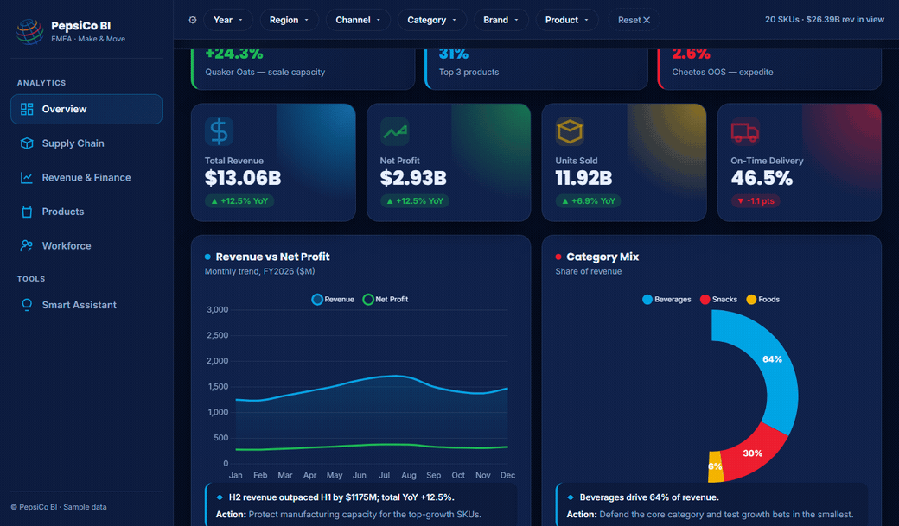
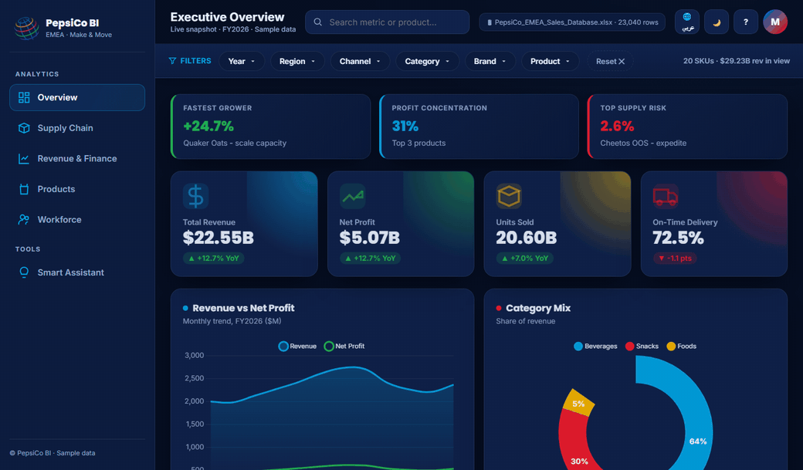
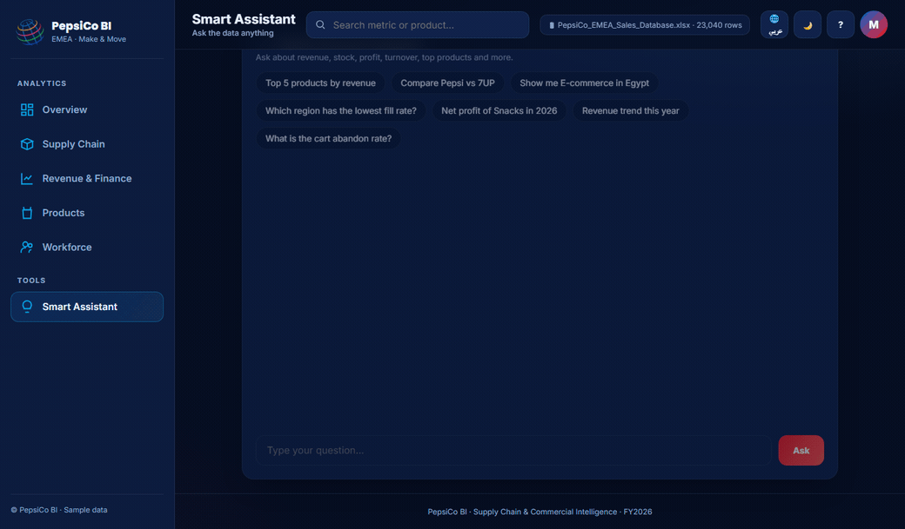
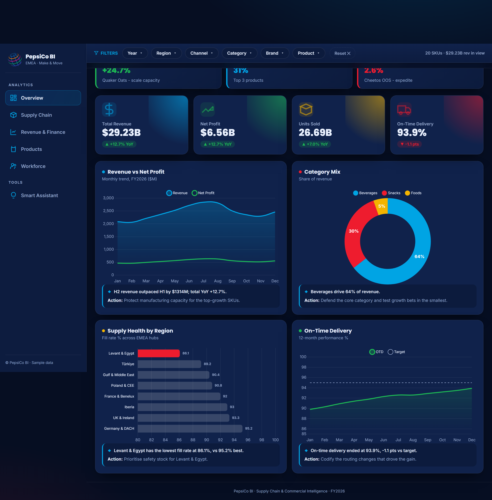
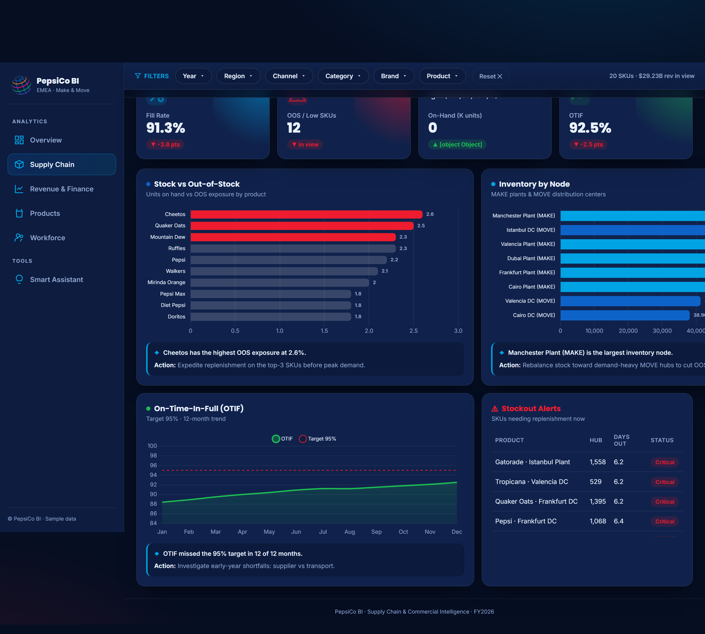
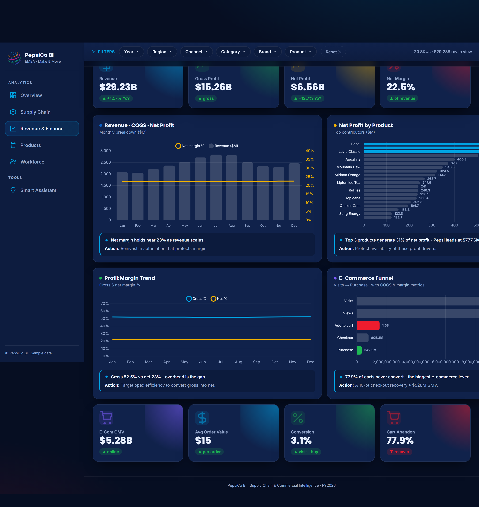
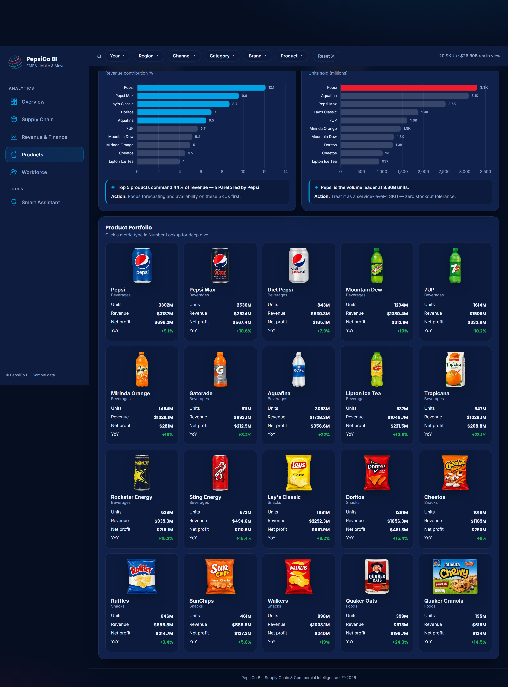
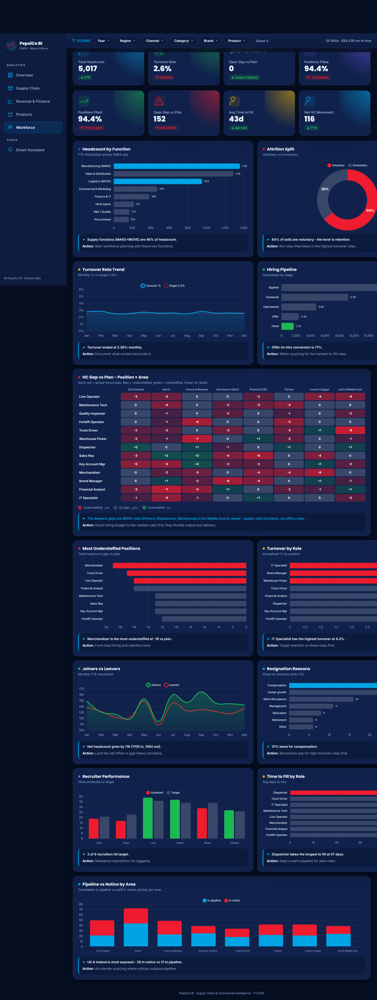
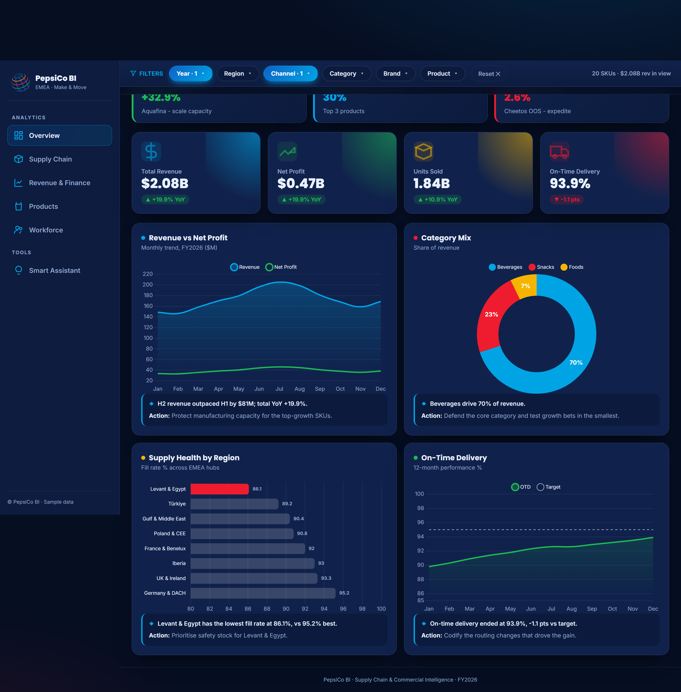
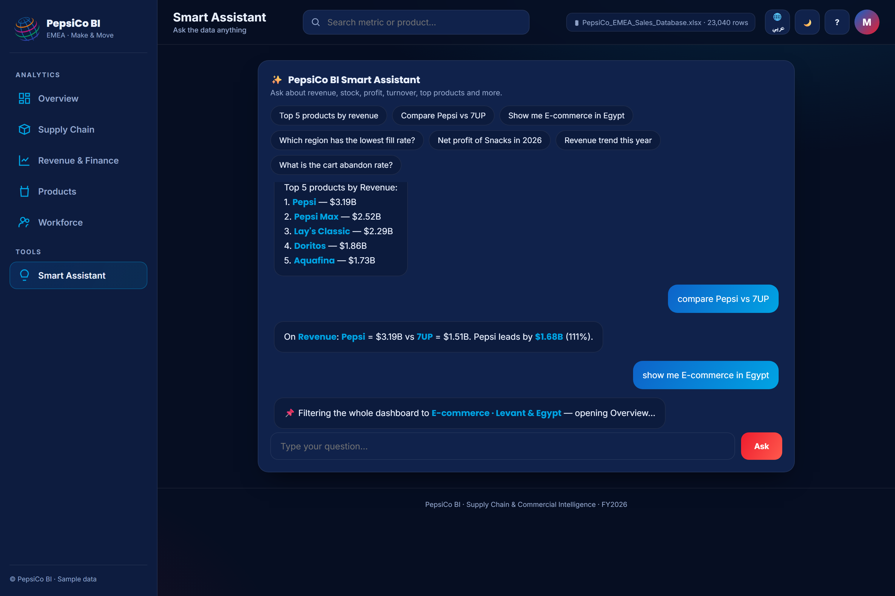

# PepsiCo Pulse BI — Supply Chain & Commercial Intelligence

**A boardroom-grade analytics portal for an EMEA beverages-and-snacks operation** — five interactive dashboards, three years of transactional data, and an assistant you can talk to, all living inside one HTML file you open with a double-click.

<p align="center">
  <a href="https://moataz-elmesmary.github.io/PepsiCo-Pulse-BI/"><b>▶ Open the live demo</b></a> &nbsp;·&nbsp; sign in with <code>moataz</code> / <code>moataz</code>
</p>

<p align="center">
  
  <br><em>Scope the whole portal to one region + one channel — every KPI, chart and insight re-derives on the spot.</em>
</p>

---

## See it in motion

**A tour of the five dashboards** — Overview, Supply Chain, Revenue & Finance, Products, Workforce:

<p align="center"></p>

**Talk to your data.** Ask in English or Arabic — it answers from the live numbers, and can reshape the dashboard for you (*"show me E-commerce in Egypt"* filters every page):

<p align="center"></p>

---

## What's inside

- **Five dashboards, a different audience each** — an executive snapshot, a supply-chain control tower, a finance & e-commerce view, a product-portfolio page, and a deep workforce / HR analytics screen.
- **Everything cross-filters.** Pick any mix of Year, Region, Channel, Category, Brand or Product and the page re-derives itself from the raw rows — these are computed views, not pictures of pre-canned numbers.
- **An assistant that understands the business.** Type a question and it pulls out the products, regions, channels and time periods you mentioned (in either language), then looks a figure up, ranks, compares, reads a trend, or applies the matching filter for you.
- **Genuinely bilingual.** The entire interface mirrors into Arabic with full right-to-left layout; dark and light themes included.
- **Three years of believable data.** 2024–2026 with category seasonality, channel and regional mix, promotions, and ~12.5% year-over-year growth — all reproducible from a single seeded generator.

> 🔐 Demo login: **`moataz` / `moataz`**

---

## 📑 Table of contents

1. [Quick start](#-quick-start)
2. [The dashboards (with screenshots)](#-the-dashboards)
3. [The Smart Assistant (NLP)](#-the-smart-assistant-nlp)
4. [Where the data comes from & how it was built](#-the-data--methodology)
5. [How it works (architecture)](#-architecture)
6. [Project structure](#-project-structure)
7. [Build & regenerate](#-build--regenerate)
8. [Deployment](#-deployment)
9. [Tech stack](#-tech-stack)

---

## 🚀 Quick start

```bash
# just open it — no install needed
start PepsiCo_Pulse_BI.html      # Windows
# or double-click the file in any modern browser
```

Log in with **`moataz` / `moataz`**. An internet connection is used on first load to fetch the chart library and fonts from a CDN (an offline build is possible — see [Deployment](#-deployment)).

---

## 📊 The dashboards

### 1) Executive Overview
The C-level snapshot: headline KPIs (Revenue, Net Profit, Units, On-Time Delivery) with **live YoY deltas**, an AI-style "key insights" strip, revenue-vs-profit trend, category mix, supply health by region, and on-time-delivery vs target.



### 2) Supply Chain
Out-of-stock exposure by SKU, inventory by node (MAKE plants vs MOVE distribution centres), OTIF trend vs the 95% target, and a live replenishment watch-list table.



### 3) Revenue & Finance
Revenue with an overlaid net-margin line, net profit by product (Pareto), gross-vs-net margin trends, and a full **e-commerce conversion funnel** (visits → views → cart → checkout → purchase) with abandonment economics.



### 4) Products
Market share, top sellers by volume, and a visual **product portfolio** grid with per-SKU units, revenue, net profit and YoY — every product image included.



### 5) Workforce
The deepest page: headcount by function, attrition split, turnover trend, hiring pipeline, a **position × area headcount-gap heatmap**, understaffed roles, turnover by role, joiners vs leavers, resignation reasons, recruiter performance, time-to-fill, and notice-vs-pipeline exposure.



### Slicers in action
Filters cross-cut everything. Below, the whole portal is scoped to **E-commerce · 2026** — KPIs, trends, regional fill rates and insights all recompute live:



---

## 🤖 The Smart Assistant (NLP)

A lightweight natural-language engine that runs entirely in the browser over the **live (filtered) data** — no API calls. It performs entity extraction (products, brands, regions, channels, categories, years — in both languages) and routes to an intent:

| Intent | Example (EN) | Example (AR) |
|---|---|---|
| **Look up** any figure, scoped | `net profit of Snacks in 2026` | `صافي ربح بيبسي في مصر` |
| **Rank** top/bottom by any dimension | `top 5 products by revenue` | `أعلى 3 قنوات بالإيراد` |
| **Compare** two entities | `compare Pepsi vs 7UP` | `قارن مصر مقابل تركيا` |
| **Trend** description | `revenue trend this year` | `اتجاه الإيراد السنة دي` |
| **Drive the dashboard** | `show me E-commerce in Egypt` | `اعرض الأونلاين في مصر` |



Answers include one-click **"Filter dashboard to this"** actions, so a question can instantly become a global filter.

---

## 🧬 The data & methodology

> **Short version:** the data is **synthetic but realistic** — generated by a small, deterministic Node script (`gen.js`) that models a PepsiCo-EMEA operation, then embedded directly into the HTML and aggregated live in the browser. It is reproducible (seeded RNG) and also exported to CSV for inspection.

### Dimensions modelled
| Dimension | Members |
|---|---|
| **Years** | 2024, 2025, 2026 (3 full years) |
| **Products** | 20 SKUs across **Beverages, Snacks, Foods** (incl. energy drinks) — each with unit price, unit cost, base volume and brand |
| **Regions** | 8 EMEA clusters (UK & Ireland, Iberia, France & Benelux, Germany & DACH, Poland & CEE, Türkiye, Levant & Egypt, Gulf & Middle East) |
| **Channels** | Modern Trade, Traditional Trade, E-commerce, Foodservice |
| **Nodes / Locations** | MAKE (plants) & MOVE (distribution centres) — 16 sites |

### The sales fact table
The core fact is generated at the grain **(year × month × product × region × channel) → units sold** = **23,040 rows**. From each row, money is derived deterministically:

```
Revenue      = units × unitPrice × channelPriceFactor
COGS         = units × unitCost  × (1 + 3% × yearIndex)     # cost inflation
GrossProfit  = Revenue − COGS
NetProfit    = GrossProfit × 0.43                            # net conversion
```

### What makes it "realistic"
- **Seasonality** per category — beverages peak in summer, snacks in Q4, foods in winter (monthly multiplier curves).
- **Compound YoY growth** (~12.5%) built from region growth bias + channel bias (e-commerce grows fastest) + per-SKU drift.
- **Monthly noise** (±14%) and occasional **promo spikes** (×1.15–1.5) so trends look organic, not flat.
- **Channel price factors** (e-commerce/foodservice price higher, wholesale lower) and **per-year cost inflation**.
- Companion datasets generated the same way: **inventory snapshot** (on-hand, reorder point, in-transit, days-cover, OOS%, status), **workforce monthly** (headcount, hires, voluntary/involuntary resignations, plan), and a **position × area headcount-gap** matrix.

### Reproducibility & inspection
- The generator uses a **seeded RNG (mulberry32)** so running it again produces the identical dataset.
- The full dataset is exported to CSV in [`data_export/`](data_export/) — `Sales_Monthly.csv`, `Dim_Products.csv`, `Dim_Locations.csv`, `Inventory_Snapshot.csv`, `Workforce_Monthly.csv`, `HC_Gap_PositionArea.csv` — so you can open every number in Excel.

> ⚠️ This is **sample/portfolio data**, not real PepsiCo figures.

---

## 🏗 Architecture

```
gen.js ──────────────┐
 (data model)        │   build.js merges everything
portal_logic.js ─────┼─────────────────────────────►  PepsiCo_Pulse_BI.html
 (engine + UI + NLP) │                                  (single self-contained file)
brand assets (CSS, images, logos) ┘
```

- **Single-file delivery.** `build.js` injects the generated data + application logic + reused styling/imagery into one portable `.html` (~2.3 MB).
- **Live aggregation engine.** A `compute()` function rebuilds *all* metrics (totals, monthly trends, per-product, per-region, margins, e-commerce funnel, workforce) from the raw fact table on every filter change — this is what makes the slicers real.
- **Global filter store** drives a re-render of the active dashboard via Chart.js.
- **In-browser NLP** normalises Arabic/English text (handles diacritics & letter variants), extracts entities, and answers from the same live aggregates.
- **Validated headlessly** — `render_smoke.js` mounts the app with a mocked DOM and exercises every page, filter and NLP query (0 errors), and the screenshots in this README are captured automatically by `screenshot.js` via the Chrome DevTools Protocol.

---

## 📁 Project structure

| Path | Description |
|---|---|
| **`PepsiCo_Pulse_BI.html`** | **The product — open or deploy this.** |
| `gen.js` | Deterministic data generator (dimensions, seasonality, facts) |
| `portal_logic.js` | App logic: aggregation engine, filters, charts, NLP assistant |
| `build.js` | Assembles the final single-file HTML |
| `export_csv.js` | Exports the dataset to CSV |
| `data_export/` | The generated dataset as CSV (open in Excel) |
| `test_compute.js` / `render_smoke.js` | Validation (aggregation correctness, full render) |
| `screenshot.js` | Auto-captures the README screenshots |
| `docs/screenshots/` | Screenshots used in this README |
| `README_PUBLISH.md` | Deployment guide (Arabic) |

---

## 🔧 Build & regenerate

```bash
node gen.js          # print a sanity check of the generated numbers
node build.js        # rebuild PepsiCo_Pulse_BI.html
node export_csv.js   # refresh the CSVs in data_export/

# tests
node test_compute.js   # aggregation numbers under each filter
node render_smoke.js   # render every page + run NLP queries (expect 0 errors)
node screenshot.js     # regenerate docs/screenshots/*.png
```

Want **more data**? Add rows to `PRODUCTS` / `REGIONS` / `CHANNELS` (or change `YEARS`) in `gen.js` and re-run `node build.js`.

---

## 🌐 Deployment

It's a static file, so any static host works:

- **Netlify Drop** — drag `PepsiCo_Pulse_BI.html` onto <https://app.netlify.com/drop> for an instant link.
- **GitHub Pages** — rename to `index.html`, enable Pages, done.
- **Company server** — drop it in SharePoint / IIS / Nginx.

For a **100% offline** build, download `chart.umd.min.js` + `chartjs-plugin-datalabels` and the fonts next to the file and swap the CDN links for local paths. Full step-by-step (Arabic) in [`README_PUBLISH.md`](README_PUBLISH.md).

---

## 🛠 Tech stack

- **Vanilla JavaScript** (no framework) — the entire engine, filter store and NLP run in ~1,000 lines.
- **[Chart.js](https://www.chartjs.org/) 4** + datalabels plugin for visualisation.
- **Node.js** for the offline data-generation / build pipeline (no runtime dependencies).
- Pure CSS (custom properties, dark/light themes, RTL).

---

<p align="center"><sub>Sample/portfolio project · not affiliated with PepsiCo · data is synthetic.</sub></p>
